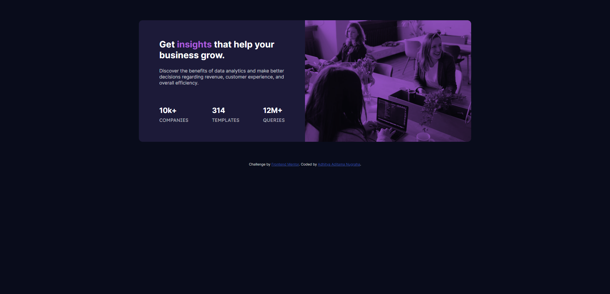
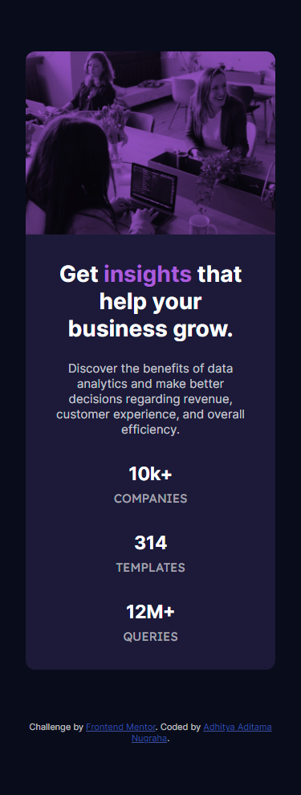

# Frontend Mentor - Stats preview card component solution

This is a solution to the [Stats preview card component challenge on Frontend Mentor](https://www.frontendmentor.io/challenges/stats-preview-card-component-8JqbgoU62). Frontend Mentor challenges help you improve your coding skills by building realistic projects.

## Table of contents

- [Overview](#overview)
  - [The challenge](#the-challenge)
  - [Screenshot](#screenshot)
  - [Links](#links)
- [My process](#my-process)
  - [Built with](#built-with)
  - [What I learned](#what-i-learned)
- [Author](#author)

## Overview

### The challenge

Users should be able to:

- View the optimal layout depending on their device's screen size

### Screenshot

### Links

- Solution URL: [Add solution URL here](https://your-solution-url.com)
- Live Site URL: [Add live site URL here](https://your-live-site-url.com)

## My process

### Built with

- Semantic HTML5 markup
- CSS custom properties
- Flexbox
- CSS Grid
- Mobile-first workflow

### What I learned

- Using different background image for different size of screen (mobile and desktop).
- Blend the "background-image" with "--primary-soft-violet-accent" using "background-blend-mode" and "opacity".
- Using very nice and cool way to make a background image work like an img element so it adjust its height automatically. You need to know the image width and height ratio. Set the height of the container to 0 and set the padding-top as percentage based upon the image ratio. [stackoverflow](https://stackoverflow.com/questions/600743/how-to-get-div-height-to-auto-adjust-to-background-size)

## Author

- LinkedIn - [aaditamanugraha](https://www.linkedin.com/in/aaditamanugraha/)
- Frontend Mentor - [@aaditamanugraha](https://www.frontendmentor.io/profile/aaditamanugraha)
